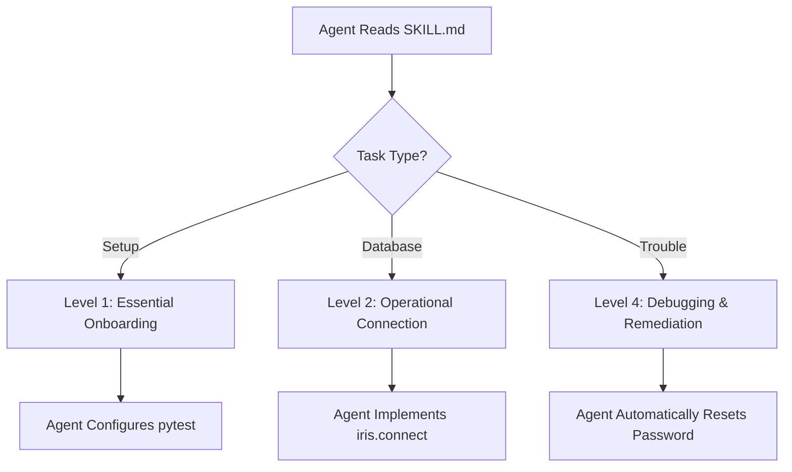

# Quickstart: Using the Agent Skill.md

**Feature Branch**: `021-add-agent-skill-md` | **Date**: 2026-01-02

## For AI Agents

To use this library effectively, first load the root `SKILL.md`.

1. **Discovery**: Read the frontmatter of `SKILL.md` to see available modules.
2. **Context Selection**: Only load the specific section (Level 2) that matches your current task (e.g., "Fixture Management").
3. **Reference Loading**: If you encounter a complex error or need deep technical context, read the referenced files in `docs/learnings/` (Level 3).

## For Developers (incorporating into a project)

1. **Install**: `pip install iris-devtester`
2. **Prompt**: Tell your assistant: "I am using `iris-devtester`. Read the `SKILL.md` at the repository root to understand the hierarchical skills available for this project."
3. **Validate**: Ask the assistant to: "Create a basic integration test using the `iris_db` fixture."

## Sample Integration Flow

