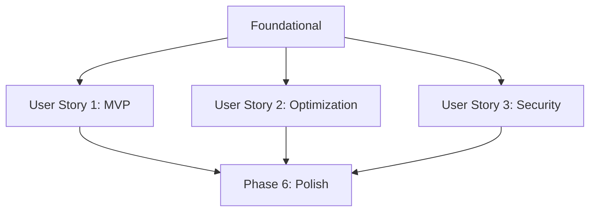

# Tasks: CPF Merge Support

**Input**: Design documents from `/specs/022-add-cpf-merge-support/`
**Prerequisites**: plan.md, spec.md, research.md, data-model.md, contracts/api.yaml

**Tests**: TDD is mandatory per Constitution Principle #3. Tests MUST be written and fail before implementation.

**Organization**: Tasks are grouped by user story to enable independent implementation and testing of each story.

## Format: `[ID] [P?] [Story] Description`

- **[P]**: Can run in parallel (different files, no dependencies)
- **[Story]**: Which user story this task belongs to (e.g., US1, US2, US3)
- Include exact file paths in descriptions

## Path Conventions

- **Source**: `iris_devtester/`
- **Tests**: `tests/`

## Phase 1: Setup (Shared Infrastructure)

**Purpose**: Project initialization and environment verification

- [ ] T001 Verify local Docker environment can mount volumes for IRIS 2019.4+
- [ ] T002 Configure pytest to allow integration tests with real containers

---

## Phase 2: Foundational (Blocking Prerequisites)

**Purpose**: Core infrastructure that MUST be complete before ANY user story can be implemented

**⚠️ CRITICAL**: No user story work can begin until this phase is complete

- [ ] T003 Create `iris_devtester/config/presets.py` with `CPFPreset` class and constants
- [ ] T004 Implement `TempCPFManager` in `iris_devtester/containers/cpf_manager.py` for file lifecycle
- [ ] T005 [P] Create unit tests for `TempCPFManager` in `tests/unit/test_cpf_manager.py`

**Checkpoint**: Foundation ready - user story implementation can now begin in parallel

---

## Phase 3: User Story 1 - Declarative Service Activation (Priority: P1) 🎯 MVP

**Goal**: Enable CallIn service via CPF merge string on startup.

**Independent Test**: Start container with CallIn CPF snippet and verify DBAPI works immediately.

### Tests for User Story 1
- [ ] T006 [US1] Create integration test for declarative CallIn activation in `tests/integration/test_cpf_merge.py` (using `iris_db_both_editions` fixture)

### Implementation for User Story 1
- [ ] T007 [US1] Implement `with_cpf_merge` method in `iris_devtester/containers/iris_container.py`
- [ ] T008 [US1] Update `IRISContainer.start` to integrate with `TempCPFManager`
- [ ] T009 [US1] Logic to set `ISC_CPF_MERGE_FILE` env var and mount volume in `iris_devtester/containers/iris_container.py`
- [ ] T017 [US1] Add `--cpf` option to `container up` command in `iris_devtester/cli/container.py`

**Checkpoint**: At this point, User Story 1 should be fully functional and testable independently

---

## Phase 4: User Story 2 - CI/CD Memory Optimization (Priority: P2)

**Goal**: Scale down IRIS memory usage via CPF presets.

**Independent Test**: Verify memory limits are applied correctly using `Config.Namespaces` or container metrics.

### Tests for User Story 2
- [ ] T010 [P] [US2] Create integration test for `CI_OPTIMIZED` preset in `tests/integration/test_cpf_presets.py` (using `iris_db_both_editions` fixture)

### Implementation for User Story 2
- [ ] T011 [US2] Ensure `CPFPreset.CI_OPTIMIZED` values correctly propagate to IRIS config

---

## Phase 5: User Story 3 - Pre-hashed Passwords (Priority: P3)

**Goal**: Skip "Password change required" via pre-hashed passwords in CPF.

**Independent Test**: Verify standard credentials work immediately without remediation calls.

### Tests for User Story 3
- [ ] T012 [P] [US3] Create integration test for `PasswordHash` support in `tests/integration/test_cpf_security.py` (using `iris_db_both_editions` fixture)

---

## Phase 6: Polish & Cross-Cutting Concerns

**Purpose**: Improvements that affect multiple user stories

- [ ] T013 [P] Update `README.md` with absolute GitHub URLs for PyPI compatibility (FR-007)
- [ ] T014 [P] Update `SKILL.md` with examples of `with_cpf_merge` usage
- [ ] T015 Run full integration suite to verify no regressions in post-startup remediation and confirm default port remains 1972 (FR-008)
- [ ] T016 Validate all relative links in documentation point to absolute GitHub paths

---

## Dependencies & Execution Order

### Phase Dependencies

- **Phase 1 (Setup)**: No dependencies.
- **Phase 2 (Foundational)**: Depends on Phase 1. Blocks all subsequent phases.
- **Phase 3 (US1)**: Depends on Phase 2.
- **Phase 4 (US2)**: Depends on Phase 2.
- **Phase 5 (US3)**: Depends on Phase 2.
- **Phase 6 (Polish)**: Depends on Phase 3, 4, 5.

### User Story Completion Order



---

## Parallel Execution Examples

### User Story 1 (P1)
```bash
# Developer A implements core logic:
Task: "Implement with_cpf_merge method in iris_devtester/containers/iris_container.py"
# Developer B writes integration tests:
Task: "Create integration test for declarative CallIn activation in tests/integration/test_cpf_merge.py"
```

### User Story 2 & 3 (P2/P3)
```bash
# These stories are independent and can be worked on simultaneously:
Task: "Create integration test for CI_OPTIMIZED preset in tests/integration/test_cpf_presets.py"
Task: "Create integration test for PasswordHash support in tests/integration/test_cpf_security.py"
```

---

## Implementation Strategy

### MVP First (User Story 1 Only)

1. Complete Phase 1 & 2 (Setup + Foundational).
2. Implement `with_cpf_merge` method.
3. Verify with `ENABLE_CALLIN` preset.
4. **STOP and VALIDATE**: Confirm DBAPI connects without remediation delay.

### Incremental Delivery

1. Foundation + US1 -> Declarative CallIn (Immediate Value).
2. Add US2 -> CI resource safety.
3. Add US3 -> Enhanced security patterns.
4. Polish -> Documentation and PyPI fixes.
